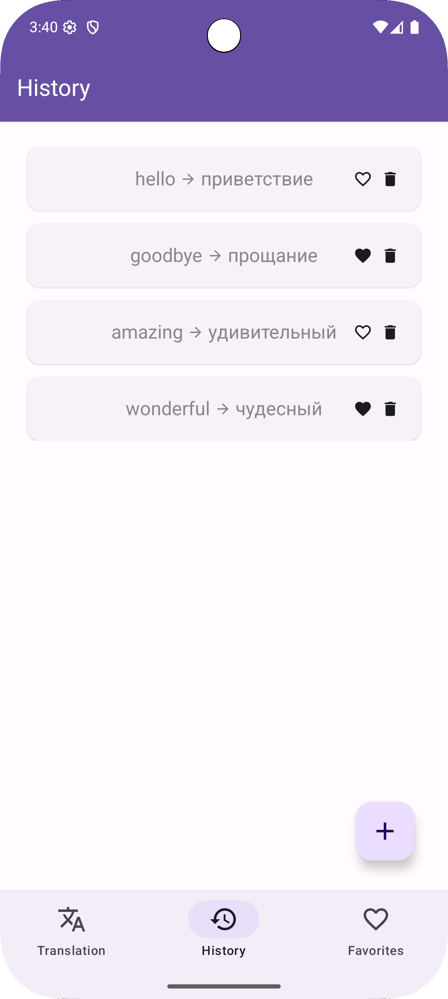
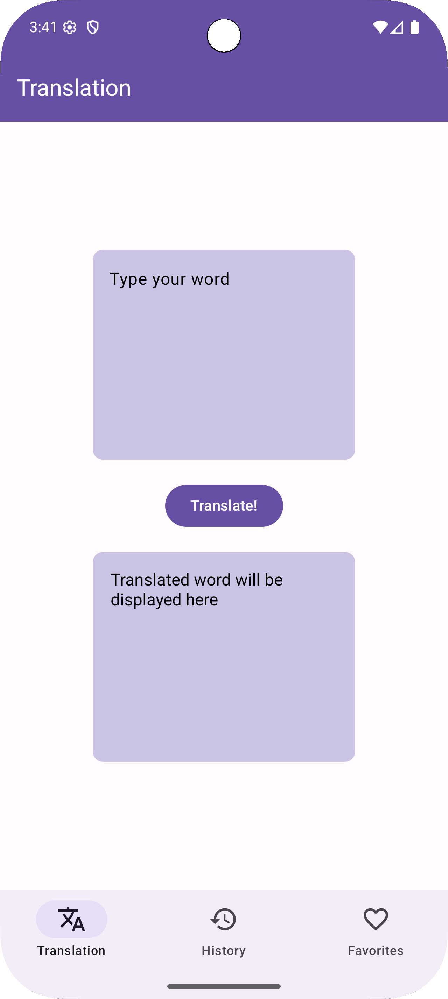

# Android-приложение для перевода слов с возможностью сохранения истории переводов и добавления их в избранное
Приложение использует [SkyengApi](https://dictionary.skyeng.ru/doc/api/external) для получения переводов и состоит из: экрана перевода, экрана истории переводов и экрана избранного.
Также поддержано кэширование переводов и офлайн-режим для ранее найденных слов. Приложение построено по принципам Clean Architecture.

## Стек технологий:
**Архитектура:** MVVM, Clean Architecture  
**Асинхронность:** Kotlin Flow, Coroutines  
**Сеть:** Retrofit, OkHttp  
**Хранение данных:** Room  
**DI:** Dagger  
**UI:** XML, ViewBinding, Navigation Component, Material Design

## Демонстрация работы

## Скриншоты

## Автор
Алина Акимова  
Android-разработчик  
[GitHub](https://github.com/malinochkaaa)